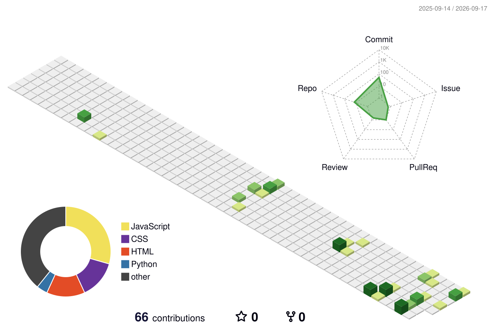

 

# 👋 Hey, I'm Arun Kumar

### 💻 Aspiring Software Developer · 🎓 IT Undergraduate · 🧠 DSA Enthusiast

  

  

---

# 👨‍💻 About Me

> **A developer in progress who believes that consistency beats perfection.**

I'm a **B.Tech Information Technology student** focused on software development, Data Structures & Algorithms, and modern web technologies.

- 🎓 B.Tech — Information Technology
- 💻 Aspiring Software Developer
- 🧠 DSA & Problem Solving
- 🌐 Full Stack Web Development
- 🚀 Real-World Project Development
- 📚 Java · Python · JavaScript · SQL
- 🎯 Preparing for Software Engineering Opportunities
- ⚡ **Learn → Build → Solve → Improve**

---

# 🧩 Tech Stack

## 👨‍💻 Programming Languages

## 🌐 Frontend

## ⚙️ Backend & Database

## 🔧 Tools

---

# 🧠 Computer Science Foundations

---

# 🚀 Featured Projects

## 🎥 MeetVerse

### Real-Time Video Calling Web Application

MeetVerse is a full-stack web application focused on real-time communication and modern web architecture.

| Feature | Description |
| :--- | :--- |
| 👥 Real-Time Communication | Video calling and communication |
| 🔐 Authentication | User authentication |
| ⚛️ Frontend | Interactive React interface |
| ⚙️ Backend | REST API architecture |
| 🗄️ Database | MongoDB integration |
| 📱 Responsive UI | Modern responsive experience |

**Built with:** `React` · `Node.js` · `Express.js` · `MongoDB`

---

# 💻 Personal Portfolio

A modern developer portfolio built to showcase projects, technical skills, education, certifications, coding journey and development experience.

**Built with:** `React` · `Vite` · `JavaScript` · `CSS`

### ✨ Highlights

- 🌗 Dark / Light Theme
- 📱 Responsive Design
- 📄 Resume Section
- 🏆 Certifications
- 💻 Project Showcase
- 📧 EmailJS Contact Form
- 🔗 GitHub · LinkedIn · LeetCode · GeeksforGeeks

&nbsp;

---

# 📊 GitHub Analytics

  

---

# 📈 GitHub Contribution Overview

---

# 🌐 3D Contribution Profile

### ✨ 3D Contribution Animation

This 3D contribution profile is generated automatically through GitHub Actions and represents my GitHub contribution activity.

---

# 🐍 Contribution Snake

<picture>

<source
media="(prefers-color-scheme: dark)"
srcset="https://raw.githubusercontent.com/kumarun415/kumarun415/output/github-snake-dark.svg"/>

<source
media="(prefers-color-scheme: light)"
srcset="https://raw.githubusercontent.com/kumarun415/kumarun415/output/github-snake.svg"/>

</picture>

<!--
---

# 💻 LeetCode Activity

  

-->
---

# 📚 Currently Learning

| Area | Current Focus |
| :---: | :--- |
| ☕ **Java** | Data Structures & Algorithms |
| 🐍 **Python** | Programming & Problem Solving |
| ⚛️ **React** | Modern Frontend Development |
| 🟢 **Node.js** | Backend Development |
| 🍃 **MongoDB** | NoSQL Database Development |
| 🗄️ **SQL** | Database & Query Optimization |
| 🧠 **CS Fundamentals** | DBMS · OS · CN · OOP |

---

# 🎯 2026 Roadmap

| Goal | Status |
| :--- | :---: |
| 🧠 Data Structures & Algorithms | 🔄 Learning |
| 💻 Full Stack Development | 🔄 Building |
| ⚛️ MERN Stack | 🔄 Building |
| 📚 CS Fundamentals | 🔄 Strengthening |
| 🌟 Open Source | 🔄 Exploring |
| 💼 Software Engineering | 🎯 Preparing |

---

# 📌 What I'm Working On

- 🔨 Building full-stack web applications
- 🧠 Solving DSA problems consistently
- 🌐 Improving frontend & backend development
- 🗄️ Strengthening database concepts
- 📚 Improving Computer Science fundamentals
- 🚀 Preparing for software engineering opportunities

---

# 🤝 Let's Connect

---

### 💡 `Learn → Build → Solve → Improve`

**Thanks for visiting my profile! ⭐**

 

